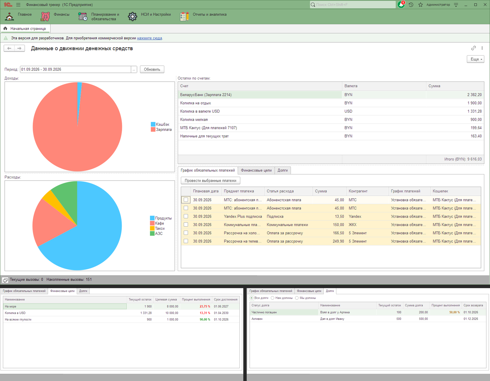
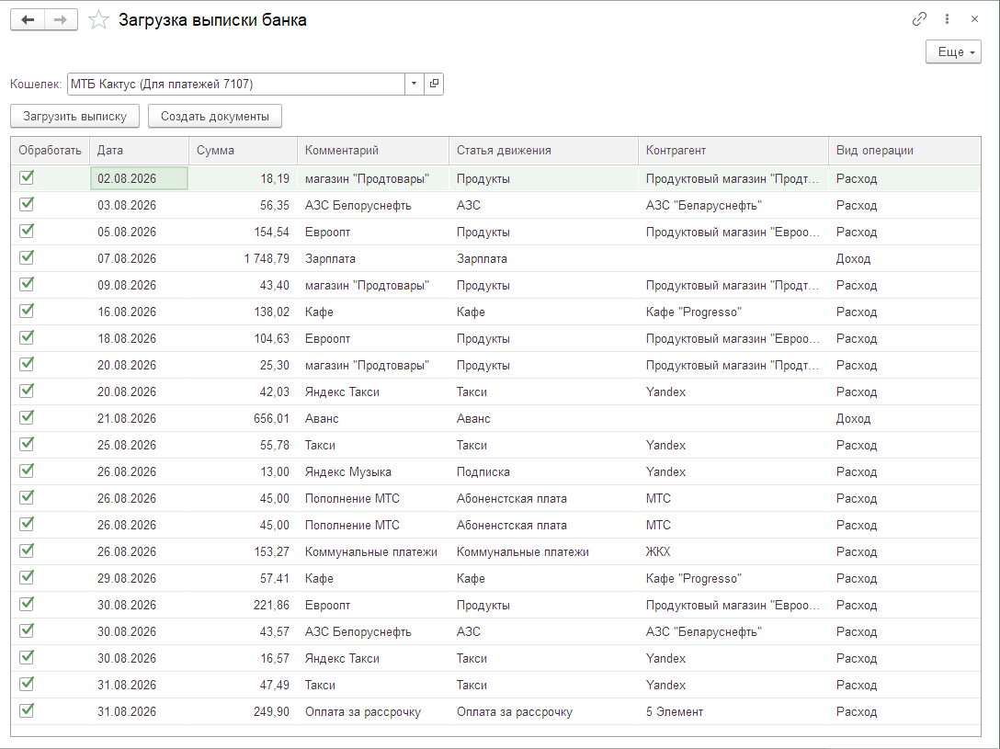
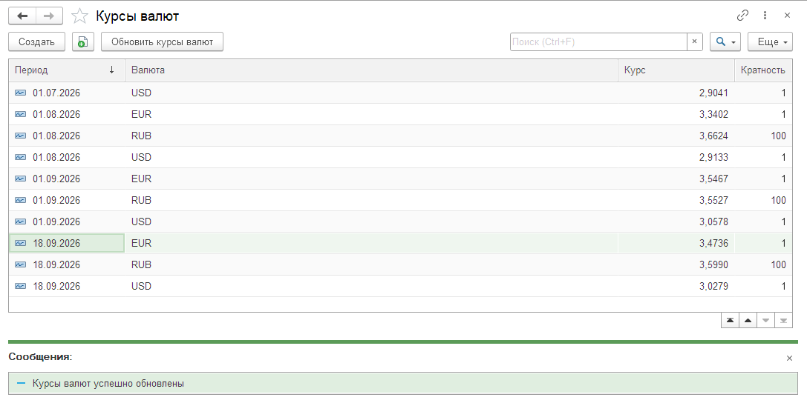
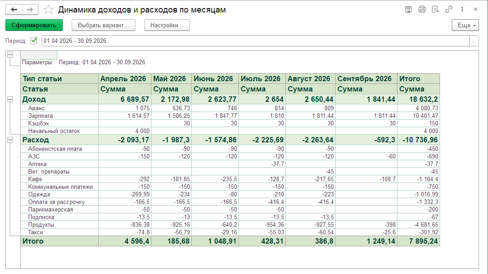
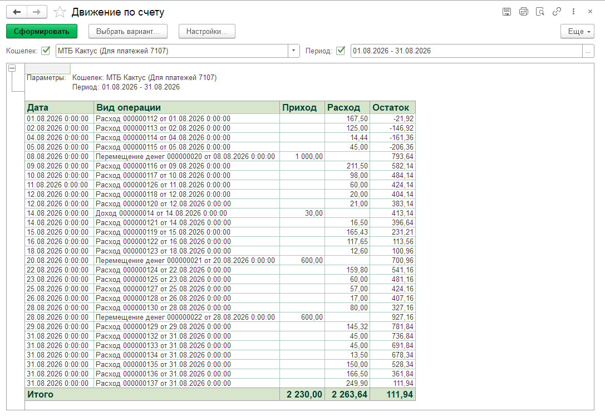
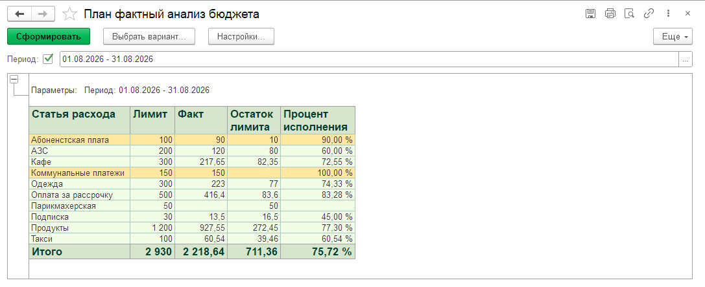
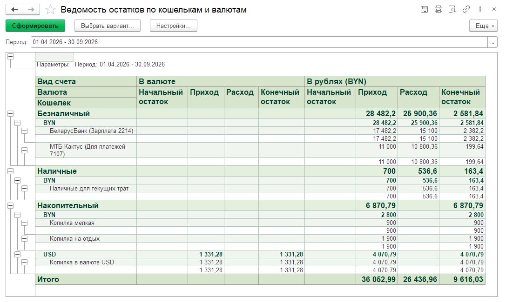
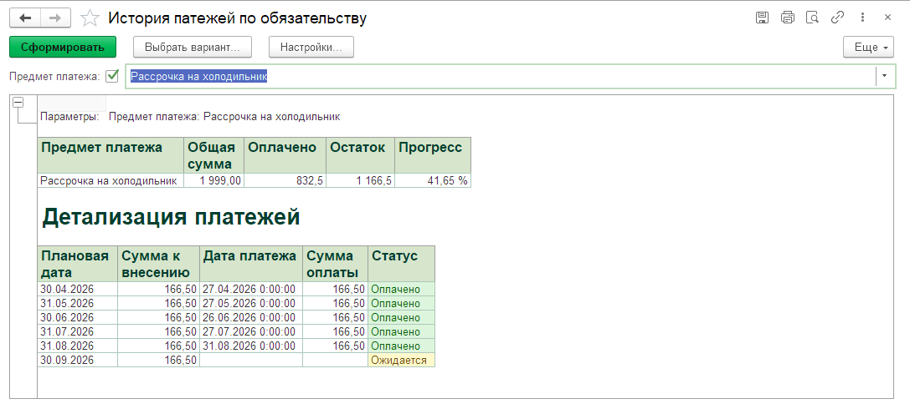

# Финансовый трекер

Учебный pet-проект на платформе **1С:Предприятие 8.3** - конфигурация для ведения личных и семейных финансов: доходы/расходы, мультивалютные счета, платежи и рассрочки, финансовые цели, долги, бюджеты, импорт выписок и аналитика. Демонстрация навыков конфигурирования 1С: справочники, документы, регистры, СКД-отчеты, роли доступа, интеграция с внешними API.

---

## 📸 Скриншоты

**Дашборд** - доходы, расходы и остатки на одном экране, ниже - цели, долги и график платежей:

**Импорт банковской выписки** - предпросмотр и заполнение (статей и контрагентов) перед созданием документов:

**Курсы валют** - регистр сведений с историей курсов и кнопкой автоматического обновления:

**Отчет «Динамика доходов и расходов по месяцам»:**

**Отчет «Движение по счету» с нарастающим остатком:**

**Отчет «План/факт анализ бюджета»:**

**Отчет «Ведомость остатков по кошелькам и валютам»:**

**Отчет «История платежей по обязательству»:**

---

## ⚙️ Возможности

### Учет денежных средств
- Несколько счетов/кошельков (наличные, карты, депозиты, накопительные счета) с разными валютами
- Документы «Доход», «Расход», «Перемещение денег»
- Контроль остатков при расходе (настраивается константой - мягкий или жесткий режим)
- Ведомость остатков по кошелькам и валютам с пересчетом в валюту учета по текущему курсу

### Мультивалютность
- Собственный справочник валют и периодический регистр сведений с курсами
- Автоматическая загрузка официальных курсов Нацбанка РБ по открытому API
- Пересчет общего остатка по всем счетам в единую валюту учета

### Обязательные платежи
- Разовые обязательства с графиком до полной суммы (рассрочки, кредиты) и бессрочные регулярные платежи (подписки, абонентская плата)
- Гибкая периодичность (день/неделя/месяц/квартал/год, точный интервал или «до конца периода»)
- Автоматический расчет следующей плановой даты на основе даты последнего фактического платежа
- Проведение выбранных платежей прямо с дашборда

### Финансовые цели
- Копилка реализована как отдельный счет с особым видом - деньги физически резервируются и не могут быть случайно потрачены
- Автоматическая простановка статуса «Достигнута» при накоплении нужной суммы

### Учет долгов
- Раздельный учет «мы должны» и «нам должны» по контрагентам
- Автоматическое определение статуса (активен / частично погашен / погашен)
- Привязка к реальному движению денег по счетам

### Бюджетирование
- Лимиты по категориям расходов на каждый месяц - задаются документом с возможностью копирования лимитов за прошлый месяц или выбора сразу всех категорий
- Мягкий (предупреждение) или жесткий (запрет проведения) контроль превышения - настраивается константой
- Отчет «План/факт» с процентом использования лимита

### Импорт банковских выписок
- Загрузка операций из Excel-файла или CSV интернет-банкинга
- Предпросмотр распознанных операций с возможностью установки статей и контрагентов перед созданием документов

### Дашборд
- Диаграммы доходов и расходов по категориям за выбранный период
- Таблицы остатков по счетам, финансовых целей, графика обязательных платежей, долгов
- Условное оформление: просроченные и приближающиеся сроки подсвечиваются цветом

### Отчеты (СКД)
- Ведомость остатков по кошелькам и валютам
- План-фактный анализ бюджета
- Динамика доходов и расходов по месяцам
- Движение по счету
- История платежей по обязательству

### Роли и права доступа
- **Администратор** - полный доступ
- **Пользователь** - ввод и редактирование операций, работа с отчетами
- **Гость** - доступ только на чтение

---

## 🛠 Технические детали

- **Платформа:** 1С:Предприятие 8.3.27, режим управляемого приложения
- **Формат поставки:** файл конфигурации `.cf`, исходники в виде XML (`src/`), также вы можете скачать файл выгрузки базы с демо-данными fintracker_demo.dt

---

## 🚀 Установка и запуск

Вы можете развернуть как чистую базу для работы с нуля, так и готовую демо-базу с предзаполненными данными за 6 месяцев.

### Вариант 1. Развертывание демо-базы с готовыми данными (рекомендуется)
1. Скачайте файл `fintracker_demo.dt` из корня репозитория.
2. Создайте новую пустую информационную базу в **1С:Предприятие**.
3. Откройте базу в режиме **Конфигуратор**.
4. Выберите пункт меню `Администрирование → Загрузить информационную базу...` и укажите скачанный `.dt` файл.
5. Запустите базу в режиме **1С:Предприятие**.

### Вариант 2. Установка чистой конфигурации (.cf)
1. Скачайте файл `fintracker.cf` из корня репозитория.
2. Создайте новую пустую информационную базу в 1С:Предприятие.
3. Откройте базу в режиме **Конфигуратор**.
4. `Конфигурация → Загрузить конфигурацию из файла...` → выберите скачанный `.cf`.
5. Обновите конфигурацию базы данных (`Конфигурация → Обновить конфигурацию базы данных`, либо F7).
6. Запустите базу в режиме **1С:Предприятие**.

При первом запуске рекомендуется:
- завести хотя бы один кошелек/счет и валюту учета;
- задать лимиты по нужным категориям расходов;
- при необходимости - обновить курсы валют через соответствующую команду.

